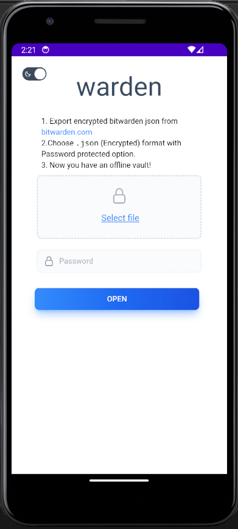

# Bitvault

Local vault for Bitwarden password manager

Built with [Tauri](https://tauri.app/) beta

Support on `Android` (`IOS` soon)

## Download
Downloads available at [bitvault/releases](https://github.com/thewh1teagle/bitvault/releases/latest)

## Features
- Navigate in your vault items
- View passwords / notes
- Easily copy vault login details / notes
- Vault remain encrypted once you exit the app

## Usage
1. Export encrypted bitwarden `json` from [vault.bitwarden.com/#tools/export](https://vault.bitwarden.com/#/tools/export)  
Choose `.json (Encrypted)` format with `Password protected` option.
2. Visit <a href="https://thewh1teagle.github.io/warden" target="_blank">thewh1teagle.github.io/warden</a> and open the json file

The vault remains encrypted once you close the app!

